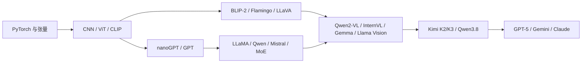
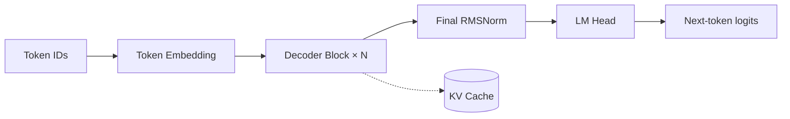
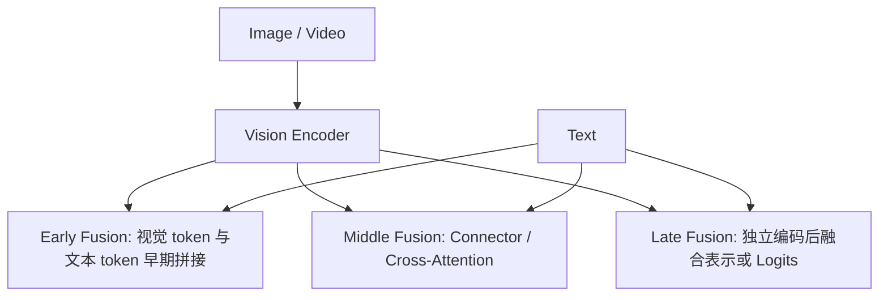

# 大语言模型与多模态大模型 Model 层系统学习方案

**版本**：1.0  
**适用对象**：具备 Python、PyTorch 和基础深度学习知识，希望从源码理解前沿模型的学习者  
**学习周期**：24 周  
**核心路线**：经典开源模型源码 -> 成熟开源多模态模型 -> 前沿开源模型 -> 闭源模型架构推断

## 一、学习目标

完成本方案后，应具备以下能力：

1. 独立解释 decoder-only Transformer 的完整数据流：
   `Token Embedding -> Decoder Block -> RMSNorm -> LM Head`。
2. 理解 MHA、GQA、MQA、RoPE、RMSNorm、SwiGLU、KV Cache、MoE、MLA 和线性注意力。
3. 从源码定位视觉编码器、连接器、跨模态注意力、视觉 token 注入和生成缓存逻辑。
4. 分析 early fusion、middle fusion、late fusion 的适用场景与工程代价。
5. 复现至少两类多模态 Model 层组件，并用测试验证张量形状和梯度流。
6. 阅读前沿开源模型源码，建立闭源模型的“公开事实、合理推断、未知信息”证据边界。

## 二、总体学习框架



学习原则：

- 先学习“小而完整”的实现，再学习“大而复杂”的工程实现。
- 每学习一个模型，都同时记录配置、输入预处理、`forward`、缓存、训练目标和评测方式。
- 任何闭源模型结论都必须标记证据等级，不能把产品行为当成内部实现事实。

## 三、24 周学习计划

| 阶段                  |  周数 | 研究对象                                                       | 重点内容                                            | 验收产出                             |
| --------------------- | ----: | -------------------------------------------------------------- | --------------------------------------------------- | ------------------------------------ |
| 1. PyTorch 与张量基础 |   1-2 | 本仓库 `models/`、PyTorch 示例                                 | Module、autograd、广播、mask、显存、shape trace     | 手写 MLP、Attention 和逐层形状日志   |
| 2. CNN、ViT 与 CLIP   |   3-4 | ResNet、ViT、CLIP                                              | patch embedding、位置编码、图像 token、对比学习     | 完成图像到 patch token 的维度推导    |
| 3. GPT 风格 Decoder   |   5-7 | nanoGPT、minGPT、LLaMA                                         | causal mask、RoPE、RMSNorm、SwiGLU、KV Cache        | 实现可生成文本的 decoder block       |
| 4. 开源 LLM 工程      |   8-9 | Mistral、Qwen2、Mixtral、DeepSeek                              | GQA/MQA、滑动窗口、MLA、MoE、量化和并行             | 读懂一个开源 LLM 的完整 `forward`    |
| 5. 经典多模态模型     | 10-12 | BLIP-2、Flamingo、LLaVA                                        | Projector、Q-Former、Perceiver、跨模态注意力        | 完成两个多模态 Model 层实验          |
| 6. 成熟开源 MLLM      | 13-16 | Qwen2-VL、Qwen2.5-VL、InternVL2、Idefics3、Gemma、Llama Vision | 动态分辨率、OCR、grounding、视频帧、视觉 token 管理 | 每个模型形成一页源码导读和 shape 表  |
| 7. 前沿开源模型       | 17-20 | Kimi K2/K2.5/K3、Qwen3.8-2.4T-A95B                             | 原生视觉、混合注意力、KDA、Gated DeltaNet、MoE、MTP | 复现混合 Attention 和稀疏 MoE        |
| 8. 闭源模型架构推断   | 21-22 | GPT-5、Gemini、Claude                                          | System Card、API 行为、reasoning router、工具调用   | 建立模型证据矩阵和推断报告           |
| 9. 综合验收           | 23-24 | 自选前沿模型                                                   | 从输入到输出完整拆解并对比技术路线                  | 架构图、源码注释、实验报告、趋势总结 |

建议每周投入比例：源码阅读 35%、手写实现 35%、实验验证 20%、学习笔记 10%。

## 四、纯语言模型 Model 层基础

### 4.1 标准数据流



### 4.2 Decoder Block

```text
x
 -> RMSNorm
 -> Self-Attention(Q/K/V + RoPE + causal mask)
 -> Residual Add
 -> RMSNorm
 -> SwiGLU MLP 或 MoE
 -> Residual Add
```

需要掌握的结构差异：

- **LLaMA/Qwen/Gemma**：decoder-only、RoPE、RMSNorm、SwiGLU。
- **Mistral**：GQA 与滑动窗口注意力。
- **Mixtral/Qwen-MoE/DeepSeek-MoE**：router、top-k experts、shared expert、load balance。
- **DeepSeek-V2/V3**：MLA 低秩压缩 KV Cache。
- **Kimi K3/Qwen3.8**：线性注意力与标准注意力混合，以降低长上下文成本。

## 五、多模态 Model 层基础

### 5.1 三类融合路线



| 路线          | 代表模型            | Model 层实现                                    | 优点                            | 局限                           |
| ------------- | ------------------- | ----------------------------------------------- | ------------------------------- | ------------------------------ |
| Late Fusion   | CLIP                | 图像塔与文本塔独立编码                          | 检索效率高、结构简单            | 不适合复杂生成和细粒度交互     |
| Middle Fusion | BLIP-2、Flamingo    | Q-Former、Perceiver、LLM 内插入 Cross-Attention | 视觉 token 可压缩、交互可控     | 结构复杂，需要额外 mask 和缓存 |
| Early Fusion  | LLaVA、Pixtral      | Projector 后将视觉 token 拼入文本序列           | 易于统一 decoder 建模、工程简单 | 序列变长，视觉 token 成本高    |
| Native Fusion | Kimi K3、Qwen3.8 等 | 多模态 token 参与主干预训练或联合训练           | 模态交互更深、长程能力更强      | 训练和数据工程复杂，复现门槛高 |

### 5.2 经典多模态模型对比

| 模型     | 视觉路径              | 融合模块                                    | 学习重点                         |
| -------- | --------------------- | ------------------------------------------- | -------------------------------- |
| CLIP     | ViT/ResNet            | 双塔对比学习                                | 图文表示空间和对比损失           |
| BLIP-2   | 冻结 ViT/CLIP         | Q-Former                                    | Query token 如何读取视觉特征     |
| Flamingo | 冻结视觉编码器        | Perceiver Resampler + gated Cross-Attention | 交错图文序列和跨模态 mask        |
| LLaVA    | CLIP ViT              | MLP Projector                               | 视觉 token 注入语言序列          |
| Qwen2-VL | ViT、动态分辨率       | Vision-Language Merger                      | 图像/视频 token、位置编码和 OCR  |
| InternVL | InternViT、多尺度切图 | MLP Projector                               | 高分辨率图像与多图 token 管理    |
| Gemma 3  | SigLIP 等视觉塔       | 原生多模态路径                              | 视觉 token 与 decoder 的联合建模 |

## 六、前沿开源模型研究重点

### 6.1 Kimi K2/K2.5/K3

- Kimi K2：超稀疏 MoE、MLA、MuonClip、Agentic RL。
- Kimi K2.5：在 K2 基础上加强原生视觉和混合视觉-文本训练。
- Kimi K3：Kimi Delta Attention、Attention Residuals、Stable LatentMoE、MoonViT-V2、百万上下文。

重点不是再实现一个 Projector，而是研究：

```text
多模态输入
 -> 视觉/视频 token 化
 -> 混合 Attention 或 KDA
 -> Attention Residuals
 -> Stable LatentMoE
 -> 长上下文统一建模
```

### 6.2 Qwen3.8-2.4T-A95B / Qwen3.8-Max

重点研究：

- 稀疏 MoE 与激活参数控制；
- Gated DeltaNet 与 Gated Attention 的周期性混合；
- 统一文本、图像和视频输入；
- MTP 对推理吞吐的影响；
- 公开权重基座与 Hosted Max 产品之间的差异。

### 6.3 前沿开源模型的统一分析表

对每个模型固定记录以下字段：

| 类别          | 记录内容                                            |
| ------------- | --------------------------------------------------- |
| Backbone      | 层数、hidden size、attention 类型、MLP/MoE 配置     |
| Modality Stem | 图像/视频/音频如何转换为 token                      |
| Fusion        | Projector、Q-Former、Cross-Attention 或原生融合位置 |
| Position      | 文本、空间、时间位置编码                            |
| Sequence      | 多模态 token 如何进入统一上下文                     |
| Cache         | 图像特征、KV 或线性状态如何复用                     |
| Training      | 预训练、对齐、SFT、RL、grounding/OCR 数据           |
| Efficiency    | token 压缩、稀疏激活、量化、并行和吞吐              |

## 七、代码实践与实验验收

实验目录：

`learning_labs/multimodal_model_layers/`

当前已提供两个基础组件：

1. `LlavaStyleVisionProjector`
   - 输入：`[B, N_vision, D_vision]`
   - 输出：`[B, N_vision, D_language]`
2. `PerceiverCrossAttention`
   - 输入：视觉 token `[B, N, D]`
   - 输出：压缩 token `[B, Q, D]`

运行验证：

```bash
python learning_labs/multimodal_model_layers/test_verify.py
```

后续实验顺序：

1. 实现 Gated DeltaNet 的简化状态更新；
2. 实现 `top-k` Sparse MoE Router；
3. 加入 load-balance loss；
4. 实现 Full Attention + Linear Attention 混合 Block；
5. 加入视频帧 token 和时间位置编码；
6. 比较 Projector 路线与 Native Fusion 路线的序列长度、显存和梯度流。

每个实验必须包含：

- 输入与输出 shape；
- attention mask 或 state 的 shape；
- 参数量和激活参数量；
- 前向传播结果；
- 梯度是否可回传；
- 至少一个边界条件测试。

## 八、闭源多模态模型的研究方法

闭源模型不应以“猜源码”为目标，而应采用证据分层：

| 证据等级 | 来源                                  | 可以得出的结论                   |
| -------- | ------------------------------------- | -------------------------------- |
| A        | 官方技术报告、System Card、Model Card | 可直接引用的架构与能力事实       |
| B        | 官方 API 行为、公开 benchmark         | 输入输出约束、推理模式和能力表现 |
| C        | 论文、专利、工程访谈                  | 可能采用的技术路线               |
| D        | 第三方逆向或博客推测                  | 只能作为假设，不能当作实现事实   |

以 GPT-5 为例，公开信息可以确认 unified system、fast/thinking model、实时 router、图像输入和 reasoning 训练；但视觉编码器、跨模态 attention、MoE 配置和具体层数仍属于未知信息。

研究报告应使用以下格式：

```text
已确认事实：
合理推断：
无法确认：
需要进一步验证的实验：
```

## 九、最终验收标准

完成学习后，选择一个前沿开源多模态模型，提交以下材料：

1. 一张从输入预处理到输出 logits 的完整架构图；
2. 一张 Model 层组件对比表；
3. `forward`、视觉 token 注入、mask、cache 的源码注释；
4. 至少两个核心组件的 PyTorch 复现；
5. 前向传播、梯度和边界条件测试结果；
6. 与 LLaVA、BLIP-2、Qwen2-VL 的路线对比；
7. 对一个闭源模型的事实/推断/未知证据矩阵；
8. 一份关于原生多模态、长上下文、MoE 和 Agent 化趋势的总结。

最终能力标准：面对一个新开源多模态模型，能够在 30 分钟内定位其配置、视觉路径、融合模块、统一序列、缓存机制和训练目标，并画出可解释的张量流图。
